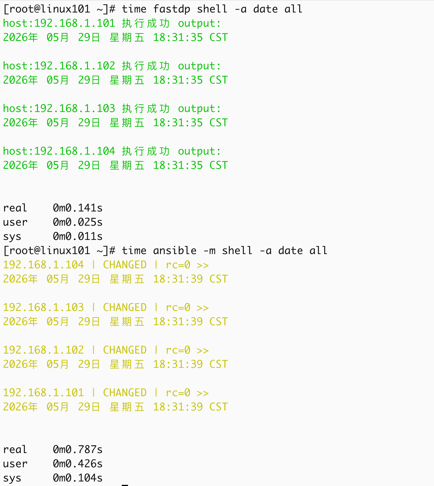
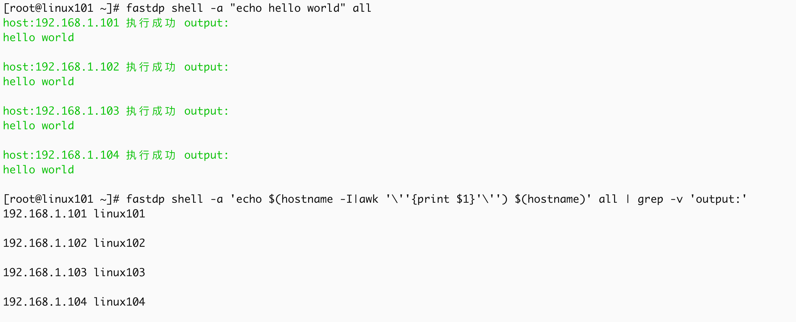
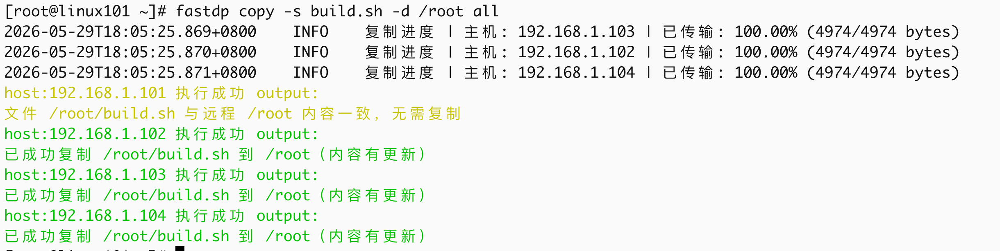
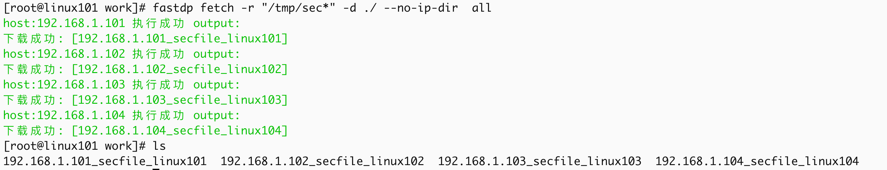
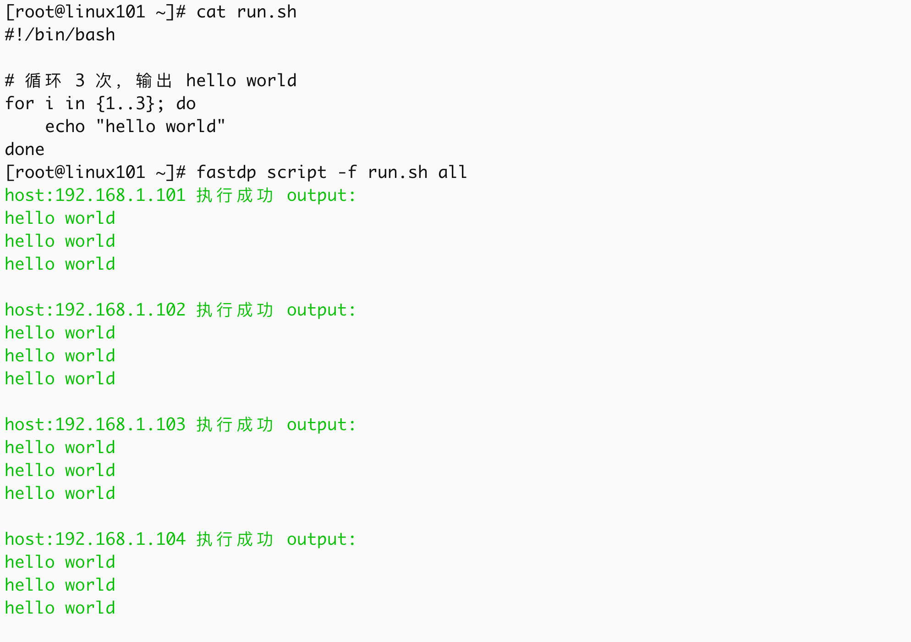
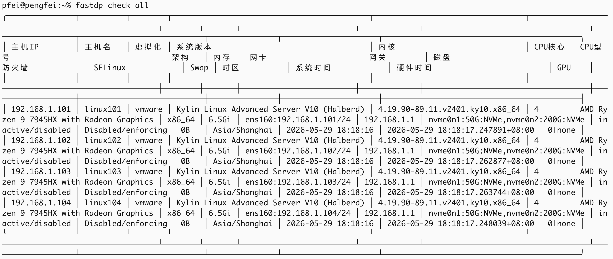
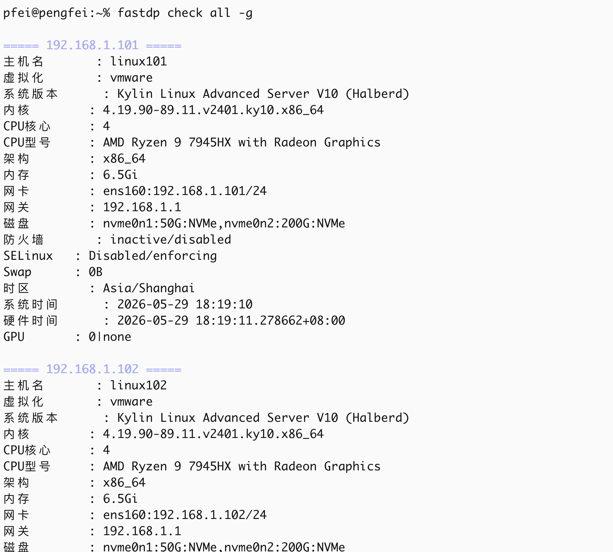
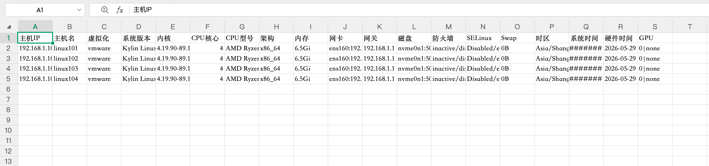

# fastdp
轻量级 Ansible 风格运维工具，支持在指定主机组上执行批量运维操作，提供多模块管理（shell 命令执行、文件复制、文件拉取、远程脚本、主机连通性检测、环境巡检等）。

## 功能特点
- 支持 6 大模块操作（shell / copy / fetch / script / ping / check）
- 基于主机组的批量管理，支持组名和 IP 混合指定
- 并发连接控制，基于 Go 协程实现高效调度
- 支持 SSH 密码认证和密钥认证（自动查找私钥）
- 灵活的配置文件多级加载

## 性能对比

在相同测试场景下（对 4 台远程主机执行 `date` 命令）：

| 工具     | 实际耗时（real） | 性能对比       |
|----------|------------------|----------------|
| fastdp   | 0m0.141s         | ✔️ 快 5.6 倍   |
| Ansible  | 0m0.787s         |                |



## 为什么快？

### 极致并发调度：
- 基于 Go 原生协程（Goroutine）实现细粒度并发控制
- 精准管理 SSH 连接生命周期
- 避免传统多进程模型的资源浪费（如 Ansible 的 fork 开销）

### 无冗余设计：
- 摒弃复杂的兼容性逻辑和冗余配置解析
- 专注核心运维场景，让每一次执行都「轻装上阵」
- 上手成本低，二进制文件大小只有 8MB 左右，无任何依赖，无需处理多版本 Python 适配

## 对运维的意义

对于批量命令执行、主机状态巡检等高频场景，fastdp 可将分钟级操作压缩至秒级，真正实现「瞬时响应」的批量运维体验 —— 这意味着：

- 巡检效率提升 10 倍以上，大规模集群操作不再漫长等待
- 故障排查更及时，秒级反馈加速问题定位

> **注**：测试环境为 4 台同网段 Linux 主机，网络延迟 <1ms；实际性能因网络环境、并发数配置略有差异，但核心优势稳定。

## 安装

### 下载发行包

#### tar.gz 包（Linux / macOS 通用）

| 平台 | 架构 | 下载地址 |
|------|------|---------|
| Linux | amd64 | [Gitee](https://gitee.com/zhao-pengfei2/fastdp/releases/download/v6/fastdp-v6-linux-amd64.tar.gz) \| [GitHub](https://github.com/perfect12312645/fastdp/releases/download/v6/fastdp-v6-linux-amd64.tar.gz) |
| Linux | arm64 | [Gitee](https://gitee.com/zhao-pengfei2/fastdp/releases/download/v6/fastdp-v6-linux-arm64.tar.gz) \| [GitHub](https://github.com/perfect12312645/fastdp/releases/download/v6/fastdp-v6-linux-arm64.tar.gz) |
| macOS | amd64 | [Gitee](https://gitee.com/zhao-pengfei2/fastdp/releases/download/v6/fastdp-v6-darwin-amd64.tar.gz) \| [GitHub](https://github.com/perfect12312645/fastdp/releases/download/v6/fastdp-v6-darwin-amd64.tar.gz) |
| macOS | arm64 | [Gitee](https://gitee.com/zhao-pengfei2/fastdp/releases/download/v6/fastdp-v6-darwin-arm64.tar.gz) \| [GitHub](https://github.com/perfect12312645/fastdp/releases/download/v6/fastdp-v6-darwin-arm64.tar.gz) |

tar.gz 包内容：

```
fastdp-v6-linux-amd64/
├── fastdp              # 主程序（可执行）
├── config.toml         # 配置文件模板
├── host                # 主机组配置模板
└── fastdp-check.sh     # 巡检脚本（check 模块使用）
```

请选择适合你的安装方式：

### 方式一：系统级安装（推荐 root 用户使用）

```bash
# 解压
tar -zxvf fastdp-v6-linux-amd64.tar.gz

# 进入目录
cd fastdp-v6-linux-amd64

# 安装到系统路径（需要 sudo）
sudo mv fastdp /usr/local/bin/
sudo mkdir -p /etc/fastdp
sudo mv * /etc/fastdp/

# 编辑主机组配置
sudo vim /etc/fastdp/host

# 安装完成后即可使用
sudo fastdp --help
```

### 方式二：用户级安装（无需 root）

```bash
# 解压
tar -zxvf fastdp-v6-linux-amd64.tar.gz

# 进入目录
cd fastdp-v6-linux-amd64

# 复制到家目录
mkdir -p ~/.fastdp/bin
cp fastdp ~/.fastdp/bin/
cp config.toml host fastdp-check.sh ~/.fastdp/

# 将二进制目录加入 PATH（追加到 ~/.bashrc 或 ~/.zshrc）
echo 'export PATH="$HOME/.fastdp/bin:$PATH"' >> ~/.bashrc
source ~/.bashrc

# 编辑配置，将 host_inventory 改成家目录的绝对路径
vim ~/.fastdp/config.toml
# host_inventory = "/home/你的用户名/.fastdp/host"

# 编辑主机组配置（默认为连接root用户，注意修改）
vim ~/.fastdp/host

# 安装完成后即可使用
fastdp --help
```

### 方式三：RPM / DEB 包（自动系统级安装，需 root）

#### RPM 包（CentOS / Rocky / openEuler 等）

> **注意**：包名中的 `ky10` 是构建环境所致，实际无任何系统依赖，可在 CentOS / Rocky / openEuler 等主流发行版上正常安装使用。

```bash
# 下载（Gitee）
wget https://gitee.com/zhao-pengfei2/fastdp/releases/download/v6/fastdp-6-1.ky10.x86_64.rpm
# 或 GitHub
wget https://github.com/perfect12312645/fastdp/releases/download/v6/fastdp-6-1.ky10.x86_64.rpm

# 安装（需要 root 权限）
sudo rpm -ivh fastdp-6-1.ky10.x86_64.rpm

# 安装完成后即可使用
fastdp --help
```

#### DEB 包（Ubuntu / Debian 等）

```bash
# 下载（Gitee）
wget https://gitee.com/zhao-pengfei2/fastdp/releases/download/v6/fastdp-v6-linux-amd64.deb
# 或 GitHub
wget https://github.com/perfect12312645/fastdp/releases/download/v6/fastdp-v6-linux-amd64.deb

# 安装（需要 root 权限）
sudo dpkg -i fastdp-v6-linux-amd64.deb

# 安装完成后即可使用
fastdp --help
```

RPM/DEB 安装后，二进制位于 `/usr/local/bin/`，配置文件位于 `/etc/fastdp/`。与方式一相同，默认以 root 身份执行。

普通用户如需自定义配置，可复制到家目录（配置加载时家目录优先级最高）：

```bash
mkdir -p ~/.fastdp
cp /etc/fastdp/config.toml ~/.fastdp/
cp /etc/fastdp/host ~/.fastdp/
cp /etc/fastdp/fastdp-check.sh ~/.fastdp/
vim ~/.fastdp/config.toml
# 将 host_inventory 的值改成家目录的绝对路径，如：
# host_inventory = "/home/你的用户名/.fastdp/host"
```

### 从源码编译

```bash
# 直接编译（适合开发者或自定义构建）
# Gitee
git clone https://gitee.com/zhao-pengfei2/fastdp.git
# 或 GitHub
git clone https://github.com/perfect12312645/fastdp.git
cd fastdp
go build -o fastdp ./cmd/main.go
sudo cp fastdp /usr/local/bin/

# 或使用构建脚本打发布包（自动下载源码并构建 tar.gz / rpm / deb）
# Gitee
wget https://gitee.com/zhao-pengfei2/fastdp/releases/download/v6/build.sh
# 或 GitHub
wget https://github.com/perfect12312645/fastdp/releases/download/v6/build.sh
chmod +x build.sh
./build.sh
```

## 配置文件加载优先级

```
1. ~/.fastdp/config.toml      （用户自定义，优先级最高）
2. /etc/fastdp/config.toml    （系统默认）
3. ./config.toml              （当前目录，兜底）
```

## 巡检脚本路径优先级（check 模块）

```
1. ~/.fastdp/fastdp-check.sh  （用户自定义，优先级最高）
2. /etc/fastdp/fastdp-check.sh（系统默认）
```

## 命令补全

### Zsh（macOS / Linux）

```bash
# 查看 $FPATH 是否包含补全目录
echo $FPATH

# macOS 安装 zsh-completions
brew install zsh-completions

# 安装 fastdp 补全（如目录不存在需先 mkdir -p）
sudo mkdir -p /usr/local/share/zsh/site-functions
sudo fastdp completion zsh > /usr/local/share/zsh/site-functions/_fastdp

# ~/.zshrc 文件中确保有下面这两行
autoload -Uz compinit
compinit

# 生效
source ~/.zshrc

# 验证
fastdp [tab][tab]
```

### Bash（Linux）

```bash
# linux 安装 bash-completions（rpm系示例）
yum -y install bash-completion

# 生成并安装补全脚本
fastdp completion bash > /usr/local/etc/bash_completion.d/fastdp
chmod +r /usr/local/etc/bash_completion.d/fastdp

# 重开终端或重新加载
source ~/.bash_profile

# 验证
fastdp [tab][tab]
```

## 快速开始

```bash
# 在主机组执行命令
fastdp shell -a "uptime" web

# 复制文件到远程主机
fastdp copy -s app.conf -d /etc/ web

# 批量拉取远程文件
fastdp fetch -r "/var/log/messages" all

# 执行远程脚本
fastdp script -f init.sh db

# 检测主机连通性
fastdp ping all

# 环境巡检
fastdp check all
```

## 模块说明

### 1. shell 模块

在远程主机执行 shell 命令。

参数：
- `-a` / `--args`：要执行的 shell 命令（必需）
- `--aggregate`：聚合函数：avg/max/min/sum/median/p95/p99/stddev（对命令输出的数字进行跨机聚合）
- `-y` / `--yes`：危险命令自动确认（CI 场景）
- `--allow-dangerous`：显式放行硬拦截的破坏性命令（不建议）
- `-s` / `--summary`：汇总模式（只显示失败主机，成功主机折叠为一行）
- `-q` / `--quiet`：静默模式（只输出命令原始 stdout，无装饰文本，适合管道和自动化）

```bash
# 基础用法
fastdp shell -a "df -h" web

# 混合指定：组 + IP 同时执行
fastdp shell -a "free -h" master node 192.168.10.100

# 引号自由使用
fastdp shell -a 'ls -l /root' all
fastdp shell -a "echo hello world" all

# 批量输出 IP + 主机名（配合模板变量 + 静默模式）
fastdp shell -a 'echo {{.ip}} $(hostname)' all -q
# 192.168.1.10 zpf-server
# 192.168.1.11 node-1

# 直接写入 /etc/hosts（集群初始化场景）
fastdp shell -a 'echo {{.ip}} $(hostname)' all -q >> /etc/hosts

# 聚合统计：平均 CPU 使用率
fastdp shell -a "mpstat 1 1 | awk '/Average/{print 100-\$NF}'" all --aggregate avg

# P95 延迟（排查毛刺）
fastdp shell -a "curl -o /dev/null -s -w '%{time_total}' http://api.example.com" all --aggregate p95

# 负载标准差（排查离群节点）
fastdp shell -a "cat /proc/loadavg | awk '{print \$1}'" all --aggregate stddev

# 中位数 CPU 使用率（不受极端值影响）
fastdp shell -a "mpstat 1 1 | awk '/平均时间/{print 100-\$NF}'" all --aggregate median
```

#### 命令安全检查

执行前自动扫描命令，分两级防护（与区间展开联动，展示目标机器清单）：

| 等级 | 行为 | 示例 |
|------|------|------|
| 硬拦截（纯破坏性） | 直接禁止执行，需 `--allow-dangerous` 显式放行 | `rm -rf /`、`rm -rf /*`、fork 炸弹、`dd ... of=/dev/sdX`、`> /dev/sdX`、根级 `chmod -R 777 /`、`kill -9 1` |
| 需确认（有合法场景） | 交互确认 `[y/N]` 后执行，`--yes` 跳过 | `rm -rf /tmp/*`、`shutdown`/`reboot`/`poweroff`、`init 0\|6` |

```bash
# 危险命令默认交互确认
fastdp shell -a 'rm -rf /tmp/*' master

# CI 场景自动确认
fastdp shell -a 'rm -rf /tmp/*' master --yes
```

每次执行都会记录一条 JSON 执行历史（时间/用户/命令/目标主机/成败与改变计数/耗时）到执行历史日志，默认随配置文件目录（history.log），可用 history_log 配置路径。script 模块同样会扫描本地脚本内容。--no-history 参数可跳过单次记录。



### 2. copy 模块

复制本地文件到远程主机，支持 MD5 校验（文件相同则跳过）、权限同步、多文件、目录递归。

参数：
- `-s` / `--source`：源文件路径（可多次指定）
- `-r` / `--recursive`：源目录路径（递归复制，可多次指定）
- `-d` / `--dest`：远程目标路径，需为绝对路径（必需）
- `--no-keep-dir`：不保留源顶层目录，平铺复制目录内容到目标（默认保留目录结构）

> 复制目录时，目标路径必须以 `/` 结尾

```bash
# 单文件复制
fastdp copy -s app.conf -d /etc/ web
fastdp copy -s run.sh -d /tmp/run.sh 192.168.1.101

# 多文件复制
fastdp copy -s a.conf -s b.sh -s c.py -d /tmp/ all

# 目录递归复制（默认保留源目录名）
fastdp copy -r ./configs/ -d /etc/app/ all
# 结果：/etc/app/configs/xxx.yml

# 目录递归复制（平铺，不保留源目录名）
fastdp copy -r ./configs/ -d /etc/app/ --no-keep-dir all
# 结果：/etc/app/xxx.yml

# 混合使用
fastdp copy -s app.conf -r ./scripts/ -d /opt/ all
```


> 大量文件传输推荐使用 rsync

### 3. fetch 模块

批量从远程主机拉取文件（基于 SFTP），支持通配符匹配。

参数：
- `-r` / `--remote`：远程文件路径，支持 `*` `?` `[]` 通配符（必需）
- `-d` / `--dest`：本地保存目录（优先使用命令行参数，其次配置文件 `default_fetch_path`，兜底 `./fastdp-fetch`）
- `--no-ip-dir`：不创建 IP 目录，文件名改为 `IP_原文件名`

> 使用通配符时必须加引号

```bash
# 批量拉取所有主机 /tmp/sec* 文件
# 重要：远程路径含通配符时，必须用引号包裹
fastdp fetch --remote "/tmp/sec*" all

# 拉取指定组/IP 的日志文件
fastdp fetch -r "/var/log/messages" master
fastdp fetch -r "/root/*.txt" 192.168.1.101

# 指定本地保存目录
fastdp fetch -r "/tmp/sec?" --dest ./my-download all

# 不创建 IP 目录，文件名为 IP_文件名
fastdp fetch -r "/tmp/*.log" --no-ip-dir all
```

> **后续优化：** 计划支持目录递归拉取和 MD5 幂等性检查（已下载且内容一致的文件自动跳过），适合定时任务场景。大量文件传输推荐使用 rsync。



### 4. script 模块

在远程主机上批量执行本地shell脚本。

> script 模块执行前会扫描脚本内容，危险命令（如 `rm -rf /`）会触发与 shell 模块相同的安全拦截/确认机制。

参数：
- `-f` / `--file`：本地脚本路径（必需，文本文件，最大 512KB）
- `--args`：传递给脚本的位置参数（空格分隔，脚本内通过 `$1` `$2` 获取）
- `--env`：传递给脚本的环境变量（格式：`KEY=val KEY2=val2`）
- `-y` / `--yes`：危险命令自动确认（CI 场景）
- `--allow-dangerous`：显式放行硬拦截的破坏性命令（不建议）
- `-q` / `--quiet`：静默模式（只输出脚本原始 stdout，适合管道和自动化）

```bash
# 基础用法
fastdp script -f run.sh all
fastdp script -f check.sh master node 192.168.1.100

# 传递参数和环境变量
fastdp script -f init.sh --args "eth0 192.168.1.1" --env "MODE=persist MTU=9000" all

# 静默模式（只输出脚本原始 stdout）
fastdp script -f check.sh all -q
```



### 5. ping 模块

测试远程主机 SSH 连通性。

```bash
# 全部主机
fastdp ping all
```

### 6. check 模块

批量主机环境巡检。执行巡检脚本（fastdp-check.sh）并格式化输出结果。

参数：
- `-g`：竖向格式化输出（类似 mysql \G）
- `-f`：导出格式，支持 csv / md / html / json
- `--only`：只检查指定字段（逗号分隔，如 `cpu_cores,cpu_model,mem`）
- `-l` / `--list-fields`：列出所有可用的检查字段 key

固定输出字段（18+ 标准字段，支持自定义字段）：

| 字段 | 说明 |
|------|------|
| hostname | 主机名 |
| virt | 虚拟化 |
| os | 系统版本 |
| kernel | 内核 |
| cpu_cores | CPU 核心 |
| cpu_model | CPU 型号 |
| arch | 架构 |
| mem | 内存 |
| net | 网卡（含速率） |
| gateway | 网关 |
| disk | 磁盘 |
| firewall | 防火墙 |
| selinux | SELinux |
| swap | Swap |
| timezone | 时区 |
| sys_time | 系统时间 |
| hw_time | 硬件时间 |
| gpu | GPU |

```bash
# 对所有主机执行环境检查（默认表格输出）
fastdp check all

# 只检查 CPU 和内存（只执行需要的检查，更高效）
fastdp check all --only cpu_cores,cpu_model,mem

# 列出所有可用的检查字段 key
fastdp check all -l

# 竖向格式化输出
fastdp check all -g

# 导出巡检报告
fastdp check all -f csv  > report.csv
fastdp check all -f md   > report.md
fastdp check all -f html > report.html
fastdp check all -f json > report.json
```

**自定义字段**：编辑巡检脚本（`~/.fastdp/fastdp-check.sh` 或 `/etc/fastdp/fastdp-check.sh`），在末尾追加 `key=value` 格式即可自动识别展示：

```bash
# 示例：添加自定义字段
echo "my_custom_field=hello"
echo "app_version=$(cat /opt/app/VERSION)"
```



竖向展示



```zsh
fastdp check all -f csv  > report.csv
open report.csv
```


生成execl表格如图所示，html和md格式同理



## 配置文件

### 路径与加载优先级

```
1. ~/.fastdp/config.toml      （用户自定义，优先级最高）
2. /etc/fastdp/config.toml    （系统默认）
3. ./config.toml              （当前目录，兜底）
```

### 配置项说明

```toml
# 主机清单路径
host_inventory = "/etc/fastdp/host"

# 默认并发数（协程数），即客户端同时连接服务端的数量
# 并发较高时瓶颈通常在客户端：fd 上限（ulimit -n）和本地端口范围
# 建议：ulimit -n 4096 + sysctl net.ipv4.ip_local_port_range="1024 65535"
concurrency = 50

# 默认 SSH 端口
default_ssh_port = 22

# 默认 SSH 用户名
default_ssh_user = "root"

# 默认 SSH 连接超时（秒），不设置或者值为0代表永不超时
default_ssh_timeout = 5

# 全局默认密码（所有机器统一密码的情况）
default_ssh_password = ""

# 默认文件拉取存放位置
default_fetch_path = "./fastdp-fetch"

# 执行历史日志开关（默认开启）
history_enabled = true

# 执行历史日志路径（空=自动跟随配置文件目录，默认 history.log）
history_log = ""
```

## 主机组配置

主机组清单文件用于定义主机分组及主机连接参数，路径在配置文件中通过 `host_inventory` 指定。

### 格式说明

```ini
[组名]
主机地址 [参数=值 ...]
```

主机地址支持 `[start:end:step]` 区间展开（零填充自动识别）：

```ini
[master]
node-[100:105] user=root port=22    # 等价于逐行写 node-100 ~ node-105
node-103 password=special           # 例外主机：单独一行覆盖参数（后声明优先）
```

### 支持的参数

| 参数     | 说明                       | 默认值      |
|----------|----------------------------|-------------|
| user     | SSH 登录用户               | root        |
| port     | SSH 端口                   | 22          |
| password | SSH 登录密码（空则密钥认证）| 空（密钥）  |

### 示例

```ini
# Web 服务器组
[web]
192.168.1.100 user=admin port=2222
192.168.1.101 password=secure@123

# 数据库服务器组
[db]
192.168.2.50 user=dbadmin
192.168.2.51 port=2200

# 混合组
[test]
10.0.0.5 user=test
```

## 全局参数

| 参数          | 缩写 | 说明                               | 默认值 |
| ------------- | ---- | ---------------------------------- | ------ |
| --concurrency | -c   | 并发连接数（客户端同时连接服务端的数量） | 50     |
| --debug       | -v   | 开启调试模式                       | false  |
| --no-history  | -    | 本次执行不记录执行历史             | false  |
| --inventory   | -i   | 指定主机清单文件（优先于配置文件） | ""     |
| --timeout     | -t   | 单台执行超时秒数（0=不限制，超时主机标记失败不拖垮整批） | 0 |
| --retry-file  | -    | 将失败主机写入文件，便于 --limit @file 重跑 | "" |
| --limit       | -    | 从文件读取目标主机列表（@file，常用于对失败主机重跑） | "" |
| --output      | -o   | 输出格式：text（人类阅读）/ JSON（结构化，适合脚本和 AI Agent） | text |
| --dry-run     | -    | 干跑模式：只显示将要执行的命令和目标主机，不实际执行（安全预览） | false |
| --version     | -V   | 显示版本信息                       | false  |
| --help        | -h   | 查看帮助信息                       | -      |

## 退出码

| 退出码 | 含义 | 处理建议 |
| ------ | ---- | -------- |
| 0 | 全部成功 | — |
| 1 | 部分失败（模块执行失败） | 查看 stderr 判断原因 |
| 2 | 参数/配置错误 | 修正命令或配置 |
| 3 | 连接失败 | 检查目标机网络/sshd |
| 4 | 超时 | 增大 --timeout 后重跑 |
| 5 | 认证失败 | 检查 SSH 凭据 |
| 6 | 程序内部错误 | 上报 bug |

## 模板变量（shell / script 模块）

命令中可使用模板变量，fastdp 会在执行前替换为当前主机的实际值：

| 变量 | 说明 | 示例 |
| ---- | ---- | ---- |
| `{{.addr}}` | host 文件原值（IP 或域名） | `zpf` 或 `192.168.1.10` |
| `{{.ip}}` | 实际 IP 地址（域名自动 DNS 解析） | `192.168.1.10` |
| `{{.port}}` | SSH 端口 | `22` |
| `{{.user}}` | SSH 用户 | `root` |

```bash
# 替代复杂的 shell IP 解析，直接写入 /etc/hosts
fastdp shell -a 'echo {{.ip}} $(hostname)' all -q >> /etc/hosts

# 脚本内也可使用模板变量
fastdp script -f init.sh --args "{{.ip}}" all
```

## 主机区间展开（所有模块通用）

目标主机/组参数支持 `[start:end:step]` 区间表达式，shell/copy/fetch/script/ping/check 均可用：

```bash
fastdp shell -a 'uptime' 'node-[100:105]'      # → node-100 ~ node-105
fastdp copy -s a.conf -d /tmp/ 'node-[100:102]'
```

> **引号说明**：`[...]` 是 shell 的 glob 语法，**必须加引号**——bash 下若当前目录恰好有同名文件会被静默替换成错误值，zsh 下直接报 `no matches found`。host 文件中使用则无需引号。

> 区间展开的详细语法（步长、零填充、参数覆盖）见 `host` 模板文件注释与[主机组配置](#主机组配置)章节。

## 注意事项

1. **主机组配置**：
   - 主机地址支持 IP 或域名
   - 若未指定 password，默认使用 SSH 密钥认证（优先读取 ~/.ssh/id_rsa、id_ed25519、id_ecdsa、id_dsa）
2. **文件复制**：
   - 远程目标路径（-d）必须为绝对路径
   - 支持保留源文件权限（自动同步源文件权限到远程文件）
   - 自动 MD5 校验，文件相同则跳过传输
3. **文件拉取**：
   - 远程路径含 `*` `?` 等通配符时，必须用引号包裹
   - 默认按 IP 创建子目录，`--no-ip-dir` 可改为 IP_文件名 模式
4. **远程脚本**：
   - 仅支持纯文本脚本（最大 512KB），禁止上传二进制文件
   - 非 .sh 后缀的文件会发出警告但不阻止执行
5. **错误排查**：
    - 开启调试模式（-v）可查看详细的 SSH 连接日志和命令执行过程
    - 若主机连接失败，检查 SSH 端口、认证方式及网络连通性
    - 使用 `--retry-file` 记录失败主机，再用 `--limit @file` 只对失败主机重跑
6. **退出码**：
    - 0=全部成功、1=部分失败、2=参数错误、3=连接失败、4=超时、5=认证失败、6=内部错误
    - 脚本和 AI Agent 可根据退出码决定重试策略
7. **check 模块**：
     - 巡检脚本路径：`~/.fastdp/fastdp-check.sh` > `/etc/fastdp/fastdp-check.sh`
     - 可自行编辑脚本内容，输出 `key=value` 格式即可自动识别
8. **权限说明**：
     - 方式一（系统级安装）仅限 root 用户执行，安装和普通用户无关
     - 方式二（用户级安装）无需 root，所有文件位于家目录，互不干扰
     - 巡检脚本中 `hw_time`（硬件时间）需要 root 权限才能读取，普通用户执行时该字段为空属正常现象
     - 普通用户如需完整巡检结果，可通过 `sudo hwclock -r` 单独获取硬件时间

## 帮助与反馈

- 查看命令帮助：`fastdp --help` 或 `fastdp [模块名] --help`
- 提交 issue：[Gitee](https://gitee.com/zhao-pengfei2/fastdp/issues) \| [GitHub](https://github.com/perfect12312645/fastdp/issues)
