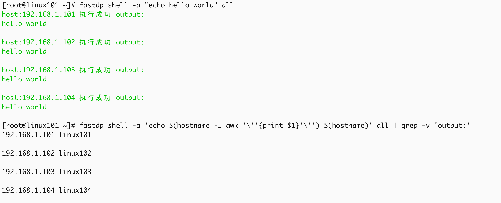
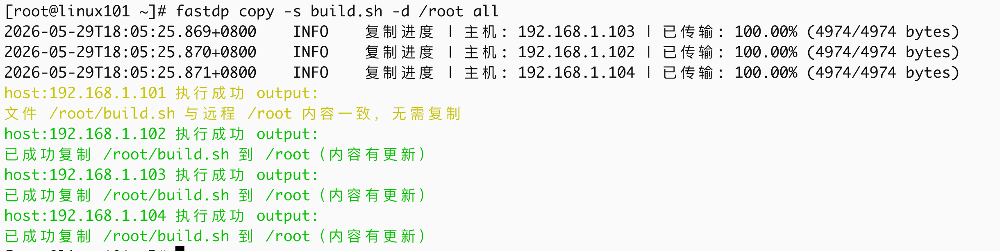
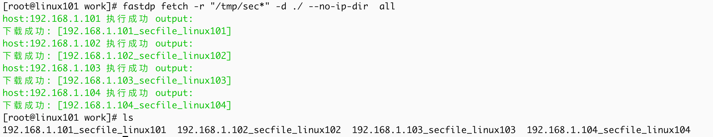
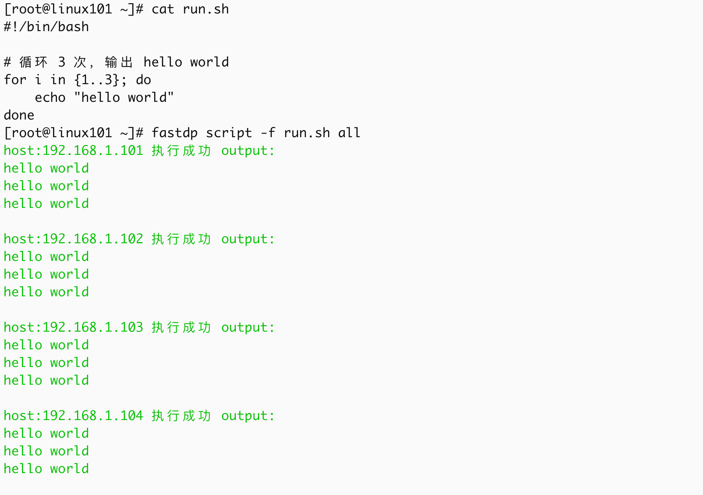
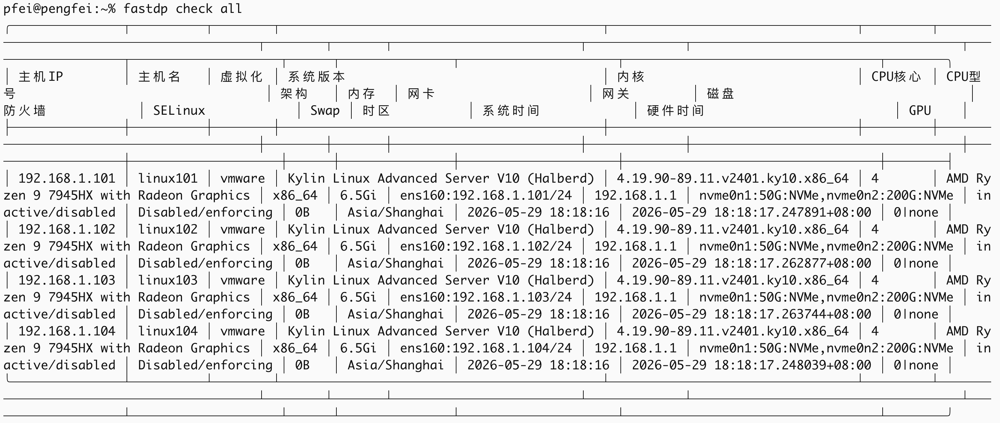
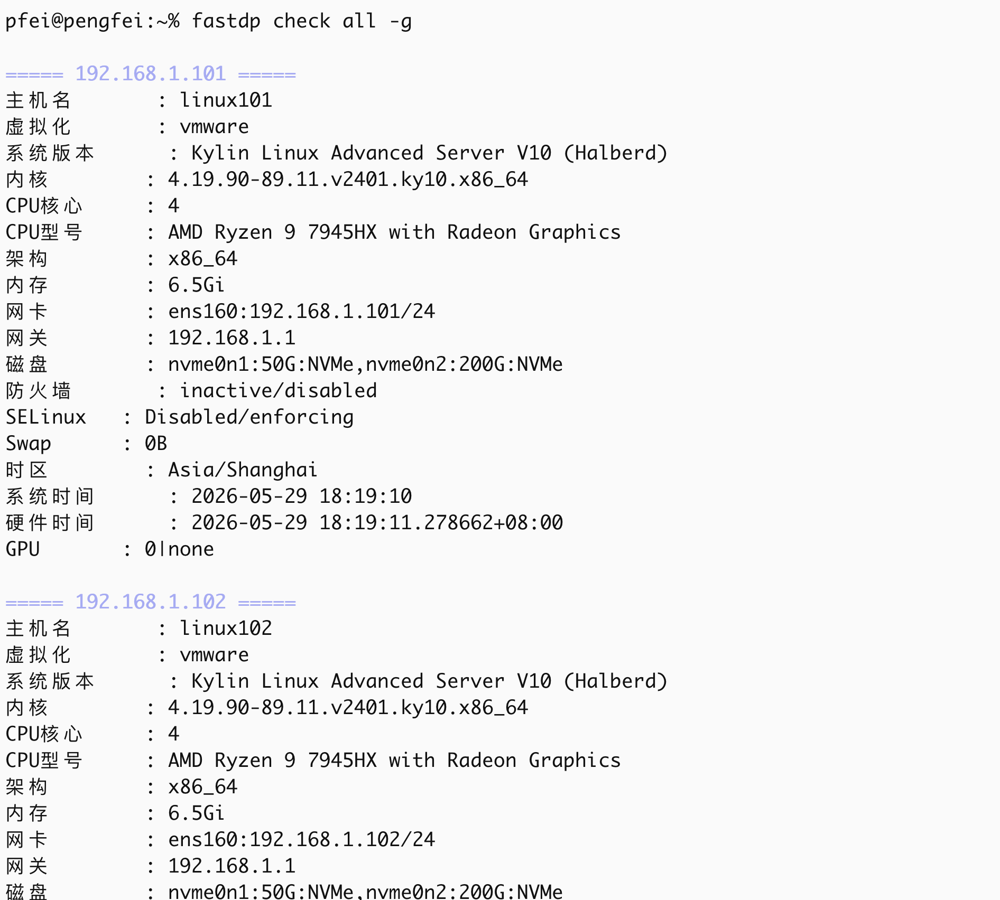
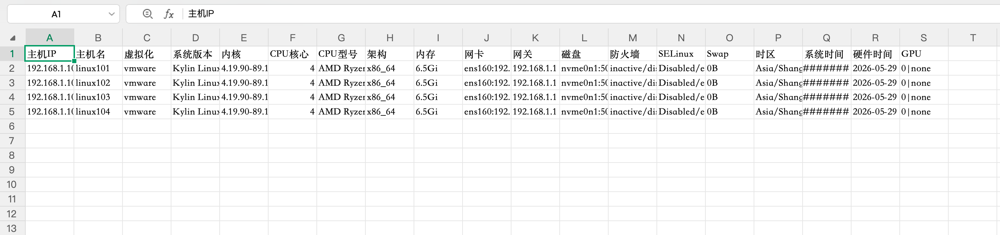

# fastdp
轻量级、单二进制、无依赖的批量运维工具。在"够用就好"的尺度下，用 Go 协程的并发优势替代 Ansible 的 Python + SSH 管道开销，专注于高频运维场景（命令执行、文件传输、状态巡检）的秒级响应。
> **fastdp 不是 Ansible 完全替代品。** 它没有 playbook、没有 facts gathering、没有变量继承体系。如果你需要复杂编排（roles、templates、idempotent modules），请使用 [Ansible](https://www.ansible.com/)。fastdp 适合"100 台机器跑条命令看结果"这种短平快的即时操作场景。

## 功能特点
- **批量命令执行**：一行命令跑完所有目标主机，秒级返回
- **网络设备（交换机）支持**：`--mode switch` 切换交互式 CLI 模式，适配 H3C/华为/Cisco 等设备的命令分割、分页禁用、命令清单批量下发（shell/copy/fetch/script/ping 均已适配）
- **文件分发与拉取**：批量推送文件到远程、批量拉取远程文件（支持通配符/目录递归）
- **批量脚本执行**：本地脚本一次发送到所有主机执行（服务器为 bash 脚本，交换机为命令清单）
- **主机巡检**：批量采集硬件信息、系统状态，表格/JSON 多格式输出
- **批量公钥推送**：一键完成多台机器的免密配置
- **主机组管理**：基于主机组的批量管理，支持组名和 IP 混合指定
- **高效并发**：基于 Go 协程实现高效调度，并发连接数可配置
- **灵活认证**：支持 SSH 密码、密钥认证（自动查找/指定/全尝试），免密优先
- **AI Agent 友好**：让 fastdp 成为 AI Agent（Claude Code、Cursor、OpenCode 等）管理多台机器时的首选工具
- **简单易用**：单二进制、零依赖、学习成本低

## 性能特点

基于 Go 原生协程（Goroutine）实现细粒度并发调度，相比多进程模型（如 Ansible 的 fork）开销更低：

- **并发调度**：Go 协程轻量，数百台主机并发无压力，响应快
- **无冗余设计**：无解释器依赖，单二进制 ~8MB，无 Python 版本适配问题
- **秒级反馈**：批量命令/巡检等高频场景，从分钟级压缩到秒级（实际性能因网络环境、并发数配置而异）

## 安装

### 下载发行包

> 最新版本见 [Gitee Releases](https://gitee.com/zhao-pengfei2/fastdp/releases) | [GitHub Releases](https://github.com/perfect12312645/fastdp/releases)

#### tar.gz 包（Linux / macOS 通用）

| 平台 | 架构 | 下载地址 |
|------|------|---------|
| Linux | amd64 | [Gitee](https://gitee.com/zhao-pengfei2/fastdp/releases/download/v6.2.0/fastdp-v6.2.0-linux-amd64.tar.gz) \| [GitHub](https://github.com/perfect12312645/fastdp/releases/download/v6.2.0/fastdp-v6.2.0-linux-amd64.tar.gz) |
| Linux | arm64 | [Gitee](https://gitee.com/zhao-pengfei2/fastdp/releases/download/v6.2.0/fastdp-v6.2.0-linux-arm64.tar.gz) \| [GitHub](https://github.com/perfect12312645/fastdp/releases/download/v6.2.0/fastdp-v6.2.0-linux-arm64.tar.gz) |
| macOS | amd64 | [Gitee](https://gitee.com/zhao-pengfei2/fastdp/releases/download/v6.2.0/fastdp-v6.2.0-darwin-amd64.tar.gz) \| [GitHub](https://github.com/perfect12312645/fastdp/releases/download/v6.2.0/fastdp-v6.2.0-darwin-amd64.tar.gz) |
| macOS | arm64 | [Gitee](https://gitee.com/zhao-pengfei2/fastdp/releases/download/v6.2.0/fastdp-v6.2.0-darwin-arm64.tar.gz) \| [GitHub](https://github.com/perfect12312645/fastdp/releases/download/v6.2.0/fastdp-v6.2.0-darwin-arm64.tar.gz) |

#### RPM / DEB 包

| 平台 | 架构 | 包类型 | 下载地址 |
|------|------|--------|---------|
| Linux | x86_64 | RPM | [Gitee](https://gitee.com/zhao-pengfei2/fastdp/releases/download/v6.2.0/fastdp-6.2.0-1.ky10.x86_64.rpm) \| [GitHub](https://github.com/perfect12312645/fastdp/releases/download/v6.2.0/fastdp-6.2.0-1.ky10.x86_64.rpm) |
| Linux | x86_64 | DEB | [Gitee](https://gitee.com/zhao-pengfei2/fastdp/releases/download/v6.2.0/fastdp-v6.2.0-linux-amd64.deb) \| [GitHub](https://github.com/perfect12312645/fastdp/releases/download/v6.2.0/fastdp-v6.2.0-linux-amd64.deb) |

> **注意：** 包名中的 `ky10` 是构建环境所致，实际无任何系统依赖，可在 CentOS / Rocky / openEuler 等主流发行版上正常安装使用。

tar.gz 包内容：

```
fastdp-v6.2.0-linux-amd64/
├── fastdp              # 主程序（可执行）
├── config.toml         # 配置文件模板
├── host                # 主机组配置模板
└── fastdp-check.sh     # 巡检脚本（check 子命令使用）
```

请选择适合你的安装方式：
### 方式一：RPM / DEB 包（自动系统级安装，需 root）

#### RPM 包（CentOS / Rocky / openEuler 等）

```bash
# 安装（需要 root 权限）
sudo rpm -ivh fastdp-6.2.0-1.ky10.x86_64.rpm

# 安装完成后即可使用
fastdp --help
```

#### DEB 包（Ubuntu / Debian 等）

```bash
# 安装（需要 root 权限）
sudo dpkg -i fastdp-v6.2.0-linux-amd64.deb

# 安装完成后即可使用
fastdp --help
```

RPM/DEB 安装后，二进制位于 `/usr/local/bin/`，配置文件位于 `/etc/fastdp/`。与方式二相同，默认以 root 身份执行。

普通用户如需自定义配置，可复制到家目录（配置加载时家目录优先级最高）：

```bash
mkdir -p ~/.fastdp
cp /etc/fastdp/config.toml ~/.fastdp/
cp /etc/fastdp/host ~/.fastdp/
cp /etc/fastdp/fastdp-check.sh ~/.fastdp/
vim ~/.fastdp/config.toml
# 将 host_inventory 的值改成家目录的绝对路径，如：
# host_inventory = "/home/你的用户名/.fastdp/host"
```
### 方式二：tar.gz 包安装

#### root用户系统级安装

```bash
# 解压
tar -zxvf fastdp-v6.2.0-linux-amd64.tar.gz

# 进入目录
cd fastdp-v6.2.0-linux-amd64

# 安装到系统路径（需要 sudo）
sudo mv fastdp /usr/local/bin/
sudo mkdir -p /etc/fastdp
sudo mv * /etc/fastdp/

# 编辑主机组配置
sudo vim /etc/fastdp/host

# 安装完成后即可使用
sudo fastdp --help
```

#### 普通用户安装（无需 root）

```bash
# 解压
tar -zxvf fastdp-v6.2.0-linux-amd64.tar.gz

# 进入目录
cd fastdp-v6.2.0-linux-amd64

# 复制到家目录
mkdir -p ~/.fastdp/bin
cp fastdp ~/.fastdp/bin/
cp config.toml host fastdp-check.sh ~/.fastdp/

# 将二进制目录加入 PATH（追加到 ~/.bashrc 或 ~/.zshrc）
echo 'export PATH="$HOME/.fastdp/bin:$PATH"' >> ~/.bashrc
source ~/.bashrc

# 编辑配置，将 host_inventory 改成家目录的绝对路径
vim ~/.fastdp/config.toml
# host_inventory = "/home/你的用户名/.fastdp/host"

# 编辑主机组配置（默认为连接root用户，注意修改）
vim ~/.fastdp/host

# 安装完成后即可使用
fastdp --help
```


### 从源码编译

```bash
# 直接编译（适合开发者或自定义构建）
# Gitee
git clone https://gitee.com/zhao-pengfei2/fastdp.git
# 或 GitHub
git clone https://github.com/perfect12312645/fastdp.git
cd fastdp
go build -o fastdp ./cmd/main.go
sudo cp fastdp /usr/local/bin/

# 或使用构建脚本打发布包（自动下载源码并构建 tar.gz / rpm / deb）
# Gitee
wget https://gitee.com/zhao-pengfei2/fastdp/releases/download/v6.2.0/build.sh
# 或 GitHub
wget https://github.com/perfect12312645/fastdp/releases/download/v6.2.0/build.sh
chmod +x build.sh
./build.sh
```

## 配置文件加载优先级

```
1. ~/.fastdp/config.toml      （用户自定义，优先级最高）
2. /etc/fastdp/config.toml    （系统默认）
3. ./config.toml              （当前目录，兜底）
```

## 巡检脚本路径优先级（check 子命令）

```
1. ~/.fastdp/fastdp-check.sh  （用户自定义，优先级最高）
2. /etc/fastdp/fastdp-check.sh（系统默认）
```


## 快速开始

```bash
# 在主机组执行命令
fastdp shell -a "uptime" web

# 复制文件到远程主机
fastdp copy -s app.conf -d /etc/ web

# 批量拉取远程文件
fastdp fetch -r "/var/log/messages" all

# 执行远程脚本
fastdp script -f init.sh db

# 检测主机连通性
fastdp ping all

# 环境巡检
fastdp check all

# 批量推送公钥到远程主机（免密配置）
fastdp copy-id --ask-pass all

# 查看主机组与机器列表
fastdp list
```

## 子命令说明

### 1. shell（批量命令执行）

在远程主机执行 shell 命令。

**交换机模式（switch）**：默认执行模式为 linux（服务器）。管理 H3C 等交换机/网络设备时，可用 `--mode switch` 或配置文件 `mode = "switch"` 切换：
- 命令按 `;` 分割**逐条执行**（智能识别转义分号 `\;`）
- 自动发送 `screen-length disable` 禁用分页（避免多屏输出等待按键超时）
- **分页禁用命令三级配置**（按需覆盖）：命令行 `--paging-disable` > host 文件该主机 `paging_disable=` > config.toml `paging_disable` > 默认 `screen-length disable`。混合设备场景（如 H3C + Cisco）可在 host 文件按每台指定，互不影响：

```bash
# host 文件：H3C 用默认，Cisco 单独覆盖
[switches]
192.168.1.10                    # 默认 screen-length disable（H3C）
192.168.1.20 paging_disable=terminal length 0   # Cisco
```
- 交互式终端执行（PTY），适配设备 CLI

```bash
# 交换机：单条命令
fastdp shell -a "display current-configuration" switches --mode switch

# 交换机：多条命令按 ; 分割（转义分号 \; 不会误拆）
fastdp shell -a "display clock;display version" switches --mode switch
```

参数：
- `-a` / `--args`：要执行的 shell 命令（必需）
- `--aggregate`：聚合函数：avg/max/min/sum/median/p95/p99/stddev（对命令输出的数字进行跨机聚合）
- `-y` / `--yes`：危险命令自动确认（CI 场景）
- `--allow-dangerous`：显式放行硬拦截的破坏性命令（不建议）
- `-s` / `--summary`：汇总模式（只显示失败主机，成功主机折叠为一行）
- `-q` / `--quiet`：静默模式（只输出命令原始 stdout，无装饰文本，适合管道和自动化）

```bash
# 基础用法
fastdp shell -a "df -h" web

# 混合指定：组 + IP 同时执行
fastdp shell -a "free -h" master node 192.168.10.100

# 引号自由使用
fastdp shell -a 'ls -l /root' all
fastdp shell -a "echo hello world" all

# 批量输出 IP + 主机名（配合模板变量 + 静默模式）
fastdp shell -a 'echo {{.ip}} $(hostname)' all -q
# 192.168.1.10 zpf-server
# 192.168.1.11 node-1

# 直接写入 /etc/hosts（集群初始化场景）
fastdp shell -a 'echo {{.ip}} $(hostname)' all -q >> /etc/hosts

# 聚合统计：平均 CPU 使用率
fastdp shell -a "mpstat 1 1 | awk '/Average/{print 100-\$NF}'" all --aggregate avg

# P95 延迟（排查毛刺）
fastdp shell -a "curl -o /dev/null -s -w '%{time_total}' http://api.example.com" all --aggregate p95

# 负载标准差（排查离群节点）
fastdp shell -a "cat /proc/loadavg | awk '{print \$1}'" all --aggregate stddev

# 中位数 CPU 使用率（不受极端值影响）
fastdp shell -a "mpstat 1 1 | awk '/平均时间/{print 100-\$NF}'" all --aggregate median
```

#### 命令安全检查

执行前自动扫描命令，分两级防护（与区间展开联动，展示目标机器清单）：

| 等级 | 行为 | 示例 |
|------|------|------|
| 硬拦截（纯破坏性） | 直接禁止执行，需 `--allow-dangerous` 显式放行 | `rm -rf /`、`rm -rf /*`、fork 炸弹、`dd ... of=/dev/sdX`、`> /dev/sdX`、根级 `chmod -R 777 /`、`kill -9 1` |
| 需确认（有合法场景） | 交互确认 `[y/N]` 后执行，`--yes` 跳过 | `rm -rf /tmp/*`、`shutdown`/`reboot`/`poweroff`、`init 0\|6` |

```bash
# 危险命令默认交互确认
fastdp shell -a 'rm -rf /tmp/*' master

# CI 场景自动确认
fastdp shell -a 'rm -rf /tmp/*' master --yes
```

每次执行都会记录一条 JSON 执行历史（时间/用户/命令/目标主机/成败与改变计数/耗时）到执行历史日志，默认随配置文件目录（history.log），可用 history_log 配置路径。script 子命令同样会扫描本地脚本内容。--no-history 参数可跳过单次记录。



### 2. copy（文件分发）

复制本地文件到远程主机，支持 MD5 校验（文件相同则跳过）、权限同步、多文件、目录递归。

> **switch 模式**下自动跳过 MD5 校验（交换机无 `md5sum` 命令，校验必然失败），等价于自动 `--skip-md5`，走 SFTP 直传。

参数：
- `-s` / `--source`：源文件路径（可多次指定）
- `-r` / `--recursive`：源目录路径（递归复制，可多次指定）
- `-d` / `--dest`：远程目标路径，需为绝对路径（必需）
- `--no-keep-dir`：不保留源顶层目录，平铺复制目录内容到目标（默认保留目录结构）
- `--skip-md5`：跳过 MD5 校验直接传输（适用于交换机等不支持 md5sum 的设备；switch 模式自动启用）

> 复制目录时，目标路径必须以 `/` 结尾

```bash
# 单文件复制
fastdp copy -s app.conf -d /etc/ web
fastdp copy -s run.sh -d /tmp/run.sh 192.168.1.101

# 多文件复制
fastdp copy -s a.conf -s b.sh -s c.py -d /tmp/ all

# 目录递归复制（默认保留源目录名）
fastdp copy -r ./configs/ -d /etc/app/ all
# 结果：/etc/app/configs/xxx.yml

# 目录递归复制（平铺，不保留源目录名）
fastdp copy -r ./configs/ -d /etc/app/ --no-keep-dir all
# 结果：/etc/app/xxx.yml

# 混合使用
fastdp copy -s app.conf -r ./scripts/ -d /opt/ all
```


> 大量文件传输推荐使用 rsync

### 3. fetch（文件拉取）

批量从远程主机拉取文件（基于 SFTP），支持通配符匹配和目录递归。

参数：
- `-r` / `--remote`：远程文件路径（必需），支持 `*` `?` `[]` 通配符，以 `/` 结尾自动递归
- `-d` / `--dest`：本地保存目录（优先使用命令行参数，其次配置文件 `default_fetch_path`，兜底 `./fastdp-fetch`）
- `--no-ip-dir`：不创建 IP 目录，文件名改为 `IP_原文件名`（仅通配符模式）
- `--recursive`：递归拉取目录（保留完整路径结构，路径以 `/` 结尾时自动启用）

> 使用通配符时必须加引号

```bash
# 批量拉取所有主机 /tmp/sec* 文件
# 【重要】远程路径含 * ? 等通配符时，必须用 " 或 ' 包裹，避免本地shell提前解析
fastdp fetch --remote "/tmp/sec*" all

# 拉取指定组/IP 的日志文件
fastdp fetch -r "/var/log/messages" master
fastdp fetch -r "/root/*.txt" 192.168.1.101

# 指定本地保存目录
fastdp fetch -r "/tmp/sec?" --dest ./my-download all

# 不创建 IP 目录，文件名为 IP_文件名
fastdp fetch -r "/tmp/*.log" --no-ip-dir all

# 递归拉取整个目录（保留完整路径结构）
fastdp fetch -r "/var/log/app/" all
# 或使用 --recursive 标志
fastdp fetch -r "/var/log/app" --recursive all
```

> **使用建议：**
> - 单文件 < 1MB 不显示进度条（传输时间过短，无显示必要）
> - 大量文件传输（单台 > 1000 文件或 > 500MB）建议使用 rsync
> - 递归模式下本地路径为 `localDest/addr/完整远程路径`，如 `fastdp-fetch/192.168.1.100/var/log/app/xxx.log`



### 4. script（批量脚本）

在远程主机上批量执行本地shell脚本。

> script 子命令执行前会扫描脚本内容，危险命令（如 `rm -rf /`）会触发与 shell 子命令相同的安全拦截/确认机制。switch 模式下为命令清单，自动跳过安全检查和 `.sh` 后缀警告。

参数：
- `-f` / `--file`：本地脚本路径（必需，文本文件，最大 512KB）
- `--args`：传递给脚本的位置参数（空格分隔，脚本内通过 `$1` `$2` 获取）
- `--env`：传递给脚本的环境变量（格式：`KEY=val KEY2=val2`）
- `-y` / `--yes`：危险命令自动确认（CI 场景）
- `--allow-dangerous`：显式放行硬拦截的破坏性命令（不建议）
- `-q` / `--quiet`：静默模式（只输出脚本原始 stdout，适合管道和自动化）

```bash
# 基础用法
fastdp script -f run.sh all
fastdp script -f check.sh master node 192.168.1.100

# 传递参数和环境变量
fastdp script -f init.sh --args "eth0 192.168.1.1" --env "MODE=persist MTU=9000" all

# 静默模式（只输出脚本原始 stdout）
fastdp script -f check.sh all -q
```

**交换机模式（switch）**：文件按**命令清单**处理而非 bash 脚本——每行一条命令逐条执行（复用 shell 的交互式 PTY 执行器，支持命令状态依赖如 `system-view`→`vlan`），自动跳过**空行**和 **`#` 注释行**：

```bash
# 命令清单示例（switch-config.txt）
# 创建管理 VLAN
system-view
vlan 10
description management-vlan
quit
interface vlan-interface 10
ip address 192.168.10.1 24
quit
```

```bash
# 交换机：批量下发配置命令清单
fastdp script -f switch-config.txt switches --mode switch
```



### 5. ping（连通性检测）

测试远程主机 SSH 连通性。

```bash
# 全部主机
fastdp ping all
```

> **switch 模式**下探测命令自动从 `echo pong` 切换为 `display clock`（交换机 CLI 无 echo 命令，`display clock` 输出设备时间，用户视图即可执行）。

### 6. check（环境巡检）

批量主机环境巡检。执行巡检脚本（fastdp-check.sh）并格式化输出结果。

参数：
- `-g`：竖向格式化输出（类似 mysql \G）
- `-f`：导出格式，支持 csv / md / html（JSON 请用全局 `-o json`）
- `--only`：只检查指定字段（逗号分隔，如 `cpu_cores,cpu_model,mem`）
- `-l` / `--list-fields`：列出所有可用的检查字段 key

**字段定义通过脚本注解驱动**：在巡检脚本中字段前加一行 `# FASTDP_FIELD: key=中文名` 注解，即可自定义中文表头、展示顺序（注解顺序即展示顺序，**主机IP 恒为第一列**），无注解的字段自动归为自定义字段追加到末尾。巡检脚本（fastdp-check.sh）是**字段定义唯一源头**，模板字段可按规则修改、移除或新增。内置字段模板（fastdp-check.sh 自带注解）：

| 字段 | 说明 |
|------|------|
| hostname | 主机名 |
| virt | 虚拟化 |
| os | 系统版本 |
| kernel | 内核 |
| cpu_cores | CPU 核心 |
| cpu_model | CPU 型号 |
| arch | 架构 |
| mem | 内存 |
| net | 网卡（含速率） |
| gateway | 网关 |
| disk | 磁盘 |
| firewall | 防火墙 |
| selinux | SELinux |
| swap | Swap |
| timezone | 时区 |
| sys_time | 系统时间 |
| hw_time | 硬件时间 |
| gpu | GPU |

```bash
# 对所有主机执行环境检查（默认表格输出）
fastdp check all

# 只检查 CPU 和内存（只执行需要的检查，更高效）
fastdp check all --only cpu_cores,cpu_model,mem

# 列出所有可用的检查字段 key
fastdp check all -l

# 竖向格式化输出
fastdp check all -g

# 导出巡检报告（csv/md/html，JSON 请用 -o json）
fastdp check all -f csv  > report.csv
fastdp check all -f md   > report.md
fastdp check all -f html > report.html

# 结构化输出（JSON，适合脚本/AI Agent）
fastdp check all -o json
```

**自定义字段**：编辑巡检脚本（`~/.fastdp/fastdp-check.sh` 或 `/etc/fastdp/fastdp-check.sh`），在末尾追加 `key=value` 格式即可自动识别展示：

```bash
# 示例：添加自定义字段
echo "my_custom_field=hello"

# 可选：加注解自定义中文表头与展示顺序
# FASTDP_FIELD: app_version=应用版本
echo "app_version=$(cat /opt/app/VERSION)"
```



竖向展示



```zsh
fastdp check all -f csv  > report.csv
open report.csv
```


生成execl表格如图所示，html和md格式同理



### 7. copy-id（批量公钥推送）

批量推送 SSH 公钥到远程主机，替代逐台执行 `ssh-copy-id`，一键完成免密配置。

参数：
- `-p` / `--pub-key`：本地公钥文件路径（默认自动发现 `~/.ssh/*.pub`）
- `--password`：统一密码（CI/CD 场景）
- `--ask-pass`：交互输入一次密码（所有机器同一密码）
- `--interactive`：逐台输入密码（机器密码不同时使用，串行执行，失败可重试）
- `--dry-run`：干跑模式：只显示预览，不实际推送

```bash
# 自动发现公钥 + 用 host 文件密码批量推送
fastdp copy-id all

# 指定公钥文件 + 统一密码
fastdp copy-id -p ~/.ssh/id_ed25519.pub --password "xxx" web

# 逐台输入密码（机器密码各不相同）
fastdp copy-id --interactive all

# 干跑模式：只显示预览
fastdp copy-id --dry-run all
```

> copy-id 内置幂等（重跑不重复追加）、权限自动设置（700/600）、失败主机 `--retry-file` 记录。

### 8. list（主机组查看）

无需打开 host 文件即可查看主机组与机器列表，区间写法自动展开为真实主机。

```bash
# 列出所有分组及机器
fastdp list

# 只看指定组
fastdp list -g web

# JSON 输出（AI Agent 友好）
fastdp list -o json
```

> 默认隐藏密码，`-v` 调试模式显示。

## 配置文件

### 路径与加载优先级

```
1. ~/.fastdp/config.toml      （用户自定义，优先级最高）
2. /etc/fastdp/config.toml    （系统默认）
3. ./config.toml              （当前目录，兜底）
```

### 配置项说明

```toml
# 主机清单路径
host_inventory = "/etc/fastdp/host"

# 默认并发数（协程数），即客户端同时连接服务端的数量
# 并发较高时瓶颈通常在客户端：fd 上限（ulimit -n）和本地端口范围
# 建议：ulimit -n 4096 + sysctl net.ipv4.ip_local_port_range="1024 65535"
concurrency = 50

# 默认 SSH 端口
default_ssh_port = 22

# 默认 SSH 用户名
default_ssh_user = "root"

# 默认 SSH 连接超时（秒），不设置或者值为0代表永不超时
default_ssh_timeout = 5

# 全局默认密码（所有机器统一密码的情况）
default_ssh_password = ""

# 默认文件拉取存放位置
default_fetch_path = "./fastdp-fetch"

# 执行历史日志开关（默认开启）
history_enabled = true

# 执行历史日志路径（空=自动跟随配置文件目录，默认 history.log）
history_log = ""

# 执行模式：linux（服务器默认）/ switch（交换机/网络设备）
# switch 模式下 shell 按 ; 分割逐条执行、自动禁用分页
mode = "linux"

# switch 模式分页禁用命令（默认 screen-length disable，适用于 H3C）
# 混合设备场景可在此设全局默认，host 文件按单台覆盖（paging_disable=xxx），命令行 --paging-disable 优先级最高
# paging_disable = "screen-length disable"
```

## 主机组配置

主机组清单文件用于定义主机分组及主机连接参数，路径在配置文件中通过 `host_inventory` 指定。

### 格式说明

```ini
[组名]
主机地址 [参数=值 ...]
```

主机地址支持 `[start:end:step]` 区间展开（零填充自动识别）：

```ini
[master]
node-[100:105] user=root port=22    # 等价于逐行写 node-100 ~ node-105
node-103 password=special           # 例外主机：单独一行覆盖参数（后声明优先）
```

### 支持的参数

| 参数     | 说明                       | 默认值      |
|----------|----------------------------|-------------|
| user     | SSH 登录用户               | root        |
| port     | SSH 端口                   | 22          |
| password | SSH 登录密码（空则密钥认证）| 空（密钥）  |
| paging_disable | switch 模式分页禁用命令（如 Cisco 用 `terminal length 0`） | 空（用默认） |

### 示例

```ini
# Web 服务器组
[web]
192.168.1.100 user=admin port=2222
192.168.1.101 password=secure@123

# 数据库服务器组
[db]
192.168.2.50 user=dbadmin
192.168.2.51 port=2200

# 混合组
[test]
10.0.0.5 user=test
```

## 全局参数

| 参数          | 缩写 | 说明                               | 默认值 |
| ------------- | ---- | ---------------------------------- | ------ |
| --concurrency | -c   | 并发连接数（客户端同时连接服务端的数量） | 50     |
| --debug       | -v   | 开启调试模式                       | false  |
| --no-history  | -    | 本次执行不记录执行历史             | false  |
| --inventory   | -i   | 指定主机清单文件（优先于配置文件） | ""     |
| --timeout     | -t   | 单台执行超时秒数（0=不限制，超时主机标记失败不拖垮整批） | 0 |
| --retry-file  | -    | 将失败主机写入文件，便于 --limit @file 重跑 | "" |
| --limit       | -    | 从文件读取目标主机列表（@file，常用于对失败主机重跑） | "" |
| --output      | -o   | 输出格式：text（人类阅读）/ JSON（结构化，适合脚本和 AI Agent） | text |
| --key         | -k   | 指定 SSH 私钥路径（默认自动发现 ~/.ssh/ 下的第一个私钥） | "" |
| --all-keys    | -    | 尝试 ~/.ssh/ 下所有私钥（适用于多机器使用不同私钥的场景，性能会下降） | false |
| --mode        | -    | 执行模式：linux / switch（默认 linux，交换机/网络设备用 switch） | linux |
| --dry-run     | -    | 干跑模式：只显示将要执行的命令和目标主机，不实际执行（安全预览） | false |
| --version     | -V   | 显示版本信息                       | false  |
| --help        | -h   | 查看帮助信息                       | -      |

## 退出码

| 退出码 | 含义 | 处理建议 |
| ------ | ---- | -------- |
| 0 | 全部成功 | — |
| 1 | 部分失败（子命令执行失败） | 查看 stderr 判断原因 |
| 2 | 参数/配置错误 | 修正命令或配置 |
| 3 | 连接失败 | 检查目标机网络/sshd |
| 4 | 超时 | 增大 --timeout 后重跑 |
| 5 | 认证失败 | 检查 SSH 凭据 |
| 6 | 程序内部错误 | 上报 bug |

## 模板变量（shell / script 子命令）

命令中可使用模板变量，fastdp 会在执行前替换为当前主机的实际值：

| 变量 | 说明 | 示例 |
| ---- | ---- | ---- |
| `{{.addr}}` | host 文件原值（IP 或域名） | `zpf` 或 `192.168.1.10` |
| `{{.ip}}` | 实际 IP 地址（域名自动 DNS 解析） | `192.168.1.10` |
| `{{.port}}` | SSH 端口 | `22` |
| `{{.user}}` | SSH 用户 | `root` |

```bash
# 替代复杂的 shell IP 解析，直接写入 /etc/hosts
fastdp shell -a 'echo {{.ip}} $(hostname)' all -q >> /etc/hosts

# 脚本内也可使用模板变量
fastdp script -f init.sh --args "{{.ip}}" all
```

## 主机区间展开（所有子命令通用）

目标主机/组参数支持 `[start:end:step]` 区间表达式，shell/copy/fetch/script/ping/check 均可用：

```bash
fastdp shell -a 'uptime' 'node-[100:105]'      # → node-100 ~ node-105
fastdp copy -s a.conf -d /tmp/ 'node-[100:102]'
```

> **引号说明**：`[...]` 是 shell 的 glob 语法，**必须加引号**——bash 下若当前目录恰好有同名文件会被静默替换成错误值，zsh 下直接报 `no matches found`。host 文件中使用则无需引号。

> 区间展开的详细语法（步长、零填充、参数覆盖）见 `host` 模板文件注释与[主机组配置](#主机组配置)章节。
## 命令补全配置

### Zsh（macOS / Linux）

```bash
# 查看 $FPATH 是否包含补全目录
echo $FPATH

# macOS 安装 zsh-completions
brew install zsh-completions

# 安装 fastdp 补全（如目录不存在需先 mkdir -p）
sudo mkdir -p /usr/local/share/zsh/site-functions
sudo fastdp completion zsh > /usr/local/share/zsh/site-functions/_fastdp

# ~/.zshrc 文件中确保有下面这两行
autoload -Uz compinit
compinit

# 生效
source ~/.zshrc

# 验证
fastdp [tab][tab]
```

### Bash（Linux）

```bash
# linux 安装 bash-completions（rpm系示例）
yum -y install bash-completion

# 生成并安装补全脚本
fastdp completion bash > /usr/local/etc/bash_completion.d/fastdp
chmod +r /usr/local/etc/bash_completion.d/fastdp

# 重开终端或重新加载
source ~/.bash_profile

# 验证
fastdp [tab][tab]
```
## 注意事项

1. **主机组配置**：
   - 主机地址支持 IP 或域名
   - 若未指定 password，默认使用 SSH 密钥认证（优先读取 ~/.ssh/id_rsa、id_ed25519、id_ecdsa、id_dsa）
2. **文件复制**：
   - 远程目标路径（-d）必须为绝对路径
   - 支持保留源文件权限（自动同步源文件权限到远程文件）
   - 自动 MD5 校验，文件相同则跳过传输
3. **文件拉取**：
   - 远程路径含 `*` `?` 等通配符时，必须用引号包裹
   - 默认按 IP 创建子目录，`--no-ip-dir` 可改为 IP_文件名 模式（仅通配符模式）
   - 路径以 `/` 结尾或 `--recursive` 标志时递归拉取目录
   - 单文件 < 1MB 不显示进度条
   - 大量文件传输（单台 > 1000 文件或 > 500MB）建议使用 rsync
4. **远程脚本**：
   - 仅支持纯文本脚本（最大 512KB），禁止上传二进制文件
   - 非 .sh 后缀的文件会发出警告但不阻止执行
5. **错误排查**：
    - 开启调试模式（-v）可查看详细的 SSH 连接日志和命令执行过程
    - 若主机连接失败，检查 SSH 端口、认证方式及网络连通性
    - 使用 `--retry-file` 记录失败主机，再用 `--limit @file` 只对失败主机重跑
6. **退出码**：
    - 0=全部成功、1=部分失败、2=参数错误、3=连接失败、4=超时、5=认证失败、6=内部错误
    - 脚本和 AI Agent 可根据退出码决定重试策略
7. **check 子命令**：
     - 巡检脚本路径：`~/.fastdp/fastdp-check.sh` > `/etc/fastdp/fastdp-check.sh`
     - 可自行编辑脚本内容，输出 `key=value` 格式即可自动识别
8. **权限说明**：
     - 方式一（系统级安装）仅限 root 用户执行，安装和普通用户无关
     - 方式二（用户级安装）无需 root，所有文件位于家目录，互不干扰
     - 巡检脚本中 `hw_time`（硬件时间）需要 root 权限才能读取，普通用户执行时该字段为空属正常现象
     - 普通用户如需完整巡检结果，可通过 `sudo hwclock -r` 单独获取硬件时间

## 帮助与反馈

- 查看命令帮助：`fastdp --help` 或 `fastdp [子命令] --help`
- 提交 issue：[Gitee](https://gitee.com/zhao-pengfei2/fastdp/issues) \| [GitHub](https://github.com/perfect12312645/fastdp/issues)
